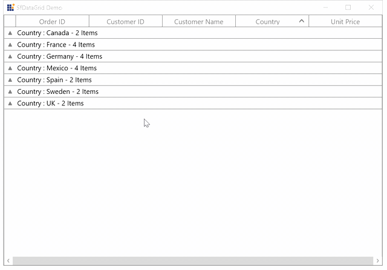

# How to Restrict the Expand and Collapse the Groups When Click on the Caption Row in WPF DataGrid?

How to restrict the expand and collapse the groups when click on the caption row in [WPF DataGrid](https://www.syncfusion.com/wpf-controls/datagrid) (SfDataGrid).

By default, when click anywhere in caption row group is expand or collapse in `DataGrid`. But you can change this by [GroupExpanding](https://help.syncfusion.com/cr/wpf/Syncfusion.UI.Xaml.Grid.SfDataGrid.html#Syncfusion_UI_Xaml_Grid_SfDataGrid_GroupExpanding), [GroupCollapsing](https://help.syncfusion.com/cr/wpf/Syncfusion.UI.Xaml.Grid.SfDataGrid.html#Syncfusion_UI_Xaml_Grid_SfDataGrid_GroupCollapsing), and [SelectionChanging](https://help.syncfusion.com/cr/wpf/Syncfusion.UI.Xaml.Grid.SfDataGrid.html#Syncfusion_UI_Xaml_Grid_SfDataGrid_SelectionChanging) events.

```c#
this.sfDataGrid.GroupCollapsing += SfDataGrid_GroupCollapsing;
this.sfDataGrid.GroupExpanding += SfDataGrid_GroupExpanding;
this.sfDataGrid.SelectionChanging += SfDataGrid_SelectionChanging;

private void SfDataGrid_SelectionChanging(object sender, GridSelectionChangingEventArgs e)
{
    var visualcontainer = this.sfDataGrid.GetVisualContainer();
    var point = Mouse.GetPosition(visualcontainer);
    //Here you can get the row and column index based on the pointer position by using PointToCellRowColumnIndex() method 
    var rowColumnIndex = visualcontainer.PointToCellRowColumnIndex(point);
    //When the rowindex is zero , the row will be header row  
    if (!rowColumnIndex.IsEmpty)
    {
        if (rowColumnIndex.ColumnIndex == 0)
            e.Cancel = true;
    }
}

private void SfDataGrid_GroupExpanding(object sender, GroupChangingEventArgs e)
{
    var visualcontainer = this.sfDataGrid.GetVisualContainer();
    var point = Mouse.GetPosition(visualcontainer);
    //Here you can get the row and column index based on the pointer position by using PointToCellRowColumnIndex() method
    var rowColumnIndex = visualcontainer.PointToCellRowColumnIndex(point);
    //When the rowindex is zero , the row will be header row 
    if (!rowColumnIndex.IsEmpty)
    {               
        if (rowColumnIndex.ColumnIndex > 0)
            e.Cancel = true;
    }
}

private void SfDataGrid_GroupCollapsing(object sender, GroupChangingEventArgs e)
{
    var visualcontainer = this.sfDataGrid.GetVisualContainer();
    var point = Mouse.GetPosition(visualcontainer);
    //Here you can get the row and column index based on the pointer position by using PointToCellRowColumnIndex() method
    var rowColumnIndex = visualcontainer.PointToCellRowColumnIndex(point);
    //When the rowindex is zero , the row will be header row 
    if (!rowColumnIndex.IsEmpty)
    {
        if (rowColumnIndex.ColumnIndex > 0)
            e.Cancel = true;
    }
}
```

